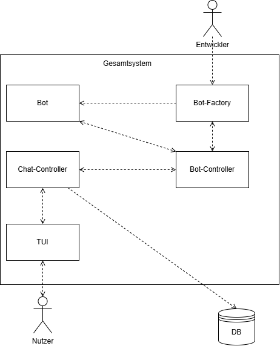
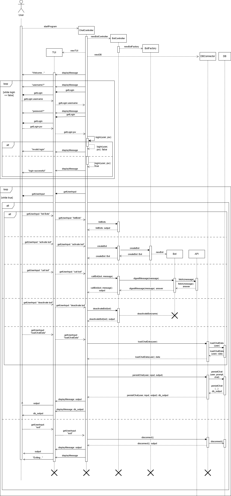

# Einführung und Ziele
<div class="formalpara-title">

## Was ist VERCX404?

</div>

VERCX404 soll als prototypisches Chatbot-Basissystem dienen, das als flexible Laufzeitumgebung für verschiedene Chatbots dient. Zugrunde liegt das Bestreben der Unternehmensleitung, das Produktportfolio durch ein modulares Chatsystem zu erweitern. Die Umsetzung erfolgt als Minimum Viable Product (MVP) mit einem Terminal User Interface (TUI). 

<div class="formalpara-title">

## Wesentliche Features

</div>

Funktionale Hauptanforderungen sind:
- die Unterstützung mehrerer vordefinierter Benutzer mit Login
- die Speicherung und Anzeige von Chatverläufen   
- das Aktivieren und Deaktivieren von Chatbots, um Ressourcen zu sparen.

Nicht-funktionale Ziele umfassen:
- Modularität
- Skalierbarkeit
- Trennung von System und Bedienoberfläche

# Kontextabgrenzung
## Fachlicher Kontext

| Kommunikationsbeziehung | Eingabe                                   | Ausgabe                                 |
|------------------------|-------------------------------------------|-----------------------------------------|
| Benutzer               | Login-Daten, Chat-Nachrichten mit Kommandos   | Chatbot-Antworten |
| Chatbots (WeatherBot, WikipediaBot, ...) | Benutzeranfrage (z.B. Ort, Suchbegriff) | Antwort des Bots (z.B. Wetter, Wiki-Text) |
| Datenbank (H2)         | Chatverlauf, Benutzername, Kommando        | Gespeicherte Chatverläufe    |

Das System nimmt von Benutzern Chat Nachrichten entgegen, die vorgefertigte Befehle enthalten. Es verarbeitet diese und leitet diese ggf. an aktivierte Chatbots weiter. Die Interaktion wird in einer lokalen Datenbank gespeichert. Die Chatbots liefern jeweils spezifische Antworten (z.B. Wetterdaten, Wikipedia-Zusammenfassungen).

---

## Technischer Kontext

| Nachbarsystem/Komponente | Kanal/Protokoll         | Zuordnung fachlicher Ein-/Ausgaben |
|--------------------------|-------------------------|------------------------------------|
| Terminal (TUI)           | Standard-IO (Konsole)   | Benutzer-Eingabe, Ausgaben       |
| H2-Datenbank             | JDBC                    | Speicherung und Abruf von Chats    |
| Wikipedia API            | HTTP/REST (über jwiki)  | WikipediaBot: Textabfragen         |
| Wetter-API    | HTTP/REST (Platzhalter) | WeatherBot: Wetterdaten            |

**Mapping:**  
- Benutzer interagiert über das Terminal (TUI) mit dem System.
- Die Datenbank wird über JDBC angesprochen.
- Bots kommunizieren ggf. über HTTP mit externen APIs.

**Verantwortlichkeiten:**  
Das System ist verantwortlich für die Benutzerinteraktion, die Verwaltung und Aktivierung/Deaktivierung von Chatbots sowie die Speicherung der Chatverläufe Externe APIs und die Datenbank sind für die Bereitstellung von Informationen bzw. die Persistenz zuständig.

# Lösungsstrategie
Die gewählten Technologien und Muster ermöglichen eine schnelle Entwicklung eines funktionsfähigen Prototyps, der modular und erweiterbar ist. Die klare Trennung der Komponenten und Schnittstellen unterstützt die langfristige Wartbarkeit und Anpassbarkeit des Systems.

## Technologieentscheidungen

- Das System wird in Java entwickelt, um Plattformunabhängigkeit und gute Erweiterbarkeit zu gewährleisten.
- Für die Persistenz der Chatverläufe wird die H2-Datenbank verwendet, da sie lokal läuft und leichtgewichtig ist. 
- Die Benutzeroberfläche wird als Terminal User Interface (TUI) umgesetzt, um eine schnelle und einfache Bedienung zu ermöglichen. Ein GUI-Interface steht für mögliche Änderungen bereit.
- Die Kommunikation mit externen Diensten (z.B. Wikipedia, Wetter) erfolgt über HTTP/REST-APIs.

## Architektur- und Entwurfsmuster

- Das System folgt dem Prinzip der Modularität: Chatbots sind als eigenständige Komponenten implementiert und können zur Laufzeit aktiviert oder deaktiviert werden.
- Die Trennung von Kernlogik (ChatApp, BotController) und Benutzeroberfläche (GUI, TUI) ermöglicht eine spätere Erweiterung um andere Interfaces (z.B. Web, GUI).
- Die Datenbankanbindung erfolgt über ein Interface (DatabaseInterface), um die Austauschbarkeit der Persistenzlösung zu gewährleisten.

## Qualitätsanforderungen

- Skalierbarkeit: Neue Bots können einfach hinzugefügt werden, ohne bestehende Komponenten zu verändern.
- Erweiterbarkeit: Die Architektur erlaubt die Integration weiterer externer APIs und Bots.
- Wartbarkeit: Klare Trennung der Verantwortlichkeiten und Verwendung von Schnittstellen erleichtern die Pflege und Weiterentwicklung.

## Organisatorische Entscheidungen

- Die Entwicklung erfolgt als Minimum Viable Product (MVP), um das Design für das Basissystem früh präsentieren zu können.
- Die Benutzerverwaltung ist zunächst einfach gehalten (vordefinierte Nutzer), kann aber später erweitert werden.

# Bausteinsicht
Das System VERCX404 ist in fünf Hauptbausteine unterteilt, die jeweils klar abgegrenzte Verantwortlichkeiten besitzen.

## Whitebox Gesamtsystem
Die Zerlegung folgt dem Prinzip der Modularität und Trennung von Verantwortlichkeiten:
- **ChatController** steuert den Ablauf und die Interaktion mit dem Benutzer.
- **BotController** verwaltet die Chatbots   und deren Status.
- **Bot** repräsentiert alle Bots und erhält eine Eingabe und gibt dazu den Inhalt aus.
- **GUI/TUI** stellt die Benutzeroberfläche bereit.
- **Database (DB)** übernimmt die Persistenz der Chatverläufe.





### Enthaltene Bausteine

| **Name**              | **Verantwortung**                                                                 |
|-----------------------|-----------------------------------------------------------------------------------|
| ChatController              | Hauptsteuerung, Benutzerinteraktion, Kommandoverarbeitung                        |
| BotController         | Verwaltung und Aktivierung/Deaktivierung von Bots                                 |
| IBot                  | Schnittstelle für alle Chatbots                                                   |
| BOT          | Liefert Wikipedia-Zusammenfassungen                                               |
| WeatherBot            | Liefert Wetterinformationen                                                       |
| GUI/TUI               | Terminal-basierte Benutzeroberfläche                                              |
| H2DatabaseConnector   | Speicherung und Abruf von Chatverläufen                                           |
| Users                 | Verwaltung und Prüfung von Benutzerdaten                                          |

### Begründung der Zerlegung

Die Zerlegung folgt dem Prinzip der Modularität und Trennung von Verantwortlichkeiten:
- **ChatApp** steuert den Ablauf und die Interaktion mit dem Benutzer.
- **BotController** verwaltet die Chatbots und deren Status.
- **IBot** ist das Interface für alle Bot-Implementierungen (z.B. WikipediaBot, WeatherBot).
- **GUI/TUI** stellt die Benutzeroberfläche bereit.
- **H2DatabaseConnector** übernimmt die Persistenz der Chatverläufe.

### Wichtige Schnittstellen

- **DatabaseInterface**: Schnittstelle zur Datenbankanbindung, ermöglicht Austauschbarkeit der Persistenzlösung.
- **GUI**: Interface für verschiedene Benutzeroberflächen (TUI, ggf. später GUI/Web).
- **IBot**: Bot-Interface für die Implementierung von weiteren Bots

---

## Blackbox-Beschreibung: BotController

**Zweck/Verantwortung:**  
Verwaltet die Instanzen der Chatbots, ermöglicht deren Aktivierung und Deaktivierung, leitet Nachrichten an die Bots weiter.

**Schnittstellen:**  
- Methoden zur Aktivierung/Deaktivierung von Bots
- Methode zum Aufruf eines Bots mit einer Nachricht

**Qualitäts-/Leistungsmerkmale:**  
- Erweiterbar für neue Bots
- Schnelle Umschaltung des Bot-Status

---

## Blackbox-Beschreibung: ChatController

**Zweck/Verantwortung:**  
Steuert den gesamten Ablauf der Chat-Anwendung.  
Führt Login-Prozesse durch, verarbeitet Benutzereingaben, leitet Befehle an den BotController oder die Datenbank weiter und koordiniert die Interaktion mit der Benutzeroberfläche.  

**Schnittstellen:**  
- Eingabe von Benutzerbefehlen über die GUI (Text-/Konsolenoberfläche)  
- Methoden zur Ausgabe von Nachrichten und Ergebnissen an die GUI  
- Aufrufe an den BotController zum Listen, Aktivieren, Deaktivieren und Ansprechen von Bots  
- Aufrufe an die Datenbank zur Persistierung und zum Laden von Chatverläufen  
- Login-Schnittstelle zur Authentifizierung von Benutzern  

**Qualitäts-/Leistungsmerkmale:**  
- Nutzerfreundlich durch klare Befehlsführung und Fehlermeldungen  
- Wiederverwendbar mit anderen GUIs, Bots, Datenbanken
- Robuste Login-Prüfung vor Hauptfunktionalitäten  
- Dauerhafte Datenspeicherung durch Datenbankanbindung  
- Stabile Ablaufsteuerung durch zentrale Befehlsverarbeitung

---

## Blackbox-Beschreibung: BotFactory

**Zweck/Verantwortung:**  
Stellt eine zentrale Fabrik-Klasse zur Verfügung, um neue Bot-Instanzen anhand ihres Namens zu erstellen.
Bietet außerdem eine Übersicht über die verfügbaren Bot-Typen. 
Hier sollten neue Bots "registriert" werden. 

**Schnittstellen:**  
- Methode zur Rückgabe einer Liste aller verfügbaren Bot-Namen (`getAvailableBotNames`)  
- Methode zur Erstellung einer neuen Bot-Instanz basierend auf einem Namen (`createBot`)  

**Qualitäts-/Leistungsmerkmale:**  
- Erweiterbar um neue Bot-Typen durch einfache Ergänzung in der Factory  
- Einheitliche Instanzerzeugung über eine zentrale Schnittstelle  
- Vermeidung von doppeltem Code durch zentrale Bot-Registrierung  
- Klare Trennung zwischen Bot-Namen und konkreter Implementierung  

---

## Blackbox-Beschreibung: H2DatabaseConnector (DB)

**Zweck/Verantwortung:**  
Speichert und lädt Chatverläufe aus einer lokalen H2-Datenbank.

**Schnittstellen:**  
- Methoden zum Speichern und Laden von Chats
- Verbindung über JDBC

**Qualitäts-/Leistungsmerkmale:**  
- Persistenz der Daten
- Austauschbar durch Implementierung von DatabaseInterface

---

## Blackbox-Beschreibung: TUI

**Zweck/Verantwortung:**  
Bietet eine textbasierte Benutzeroberfläche für die Chat-Anwendung.  
Ermöglicht die Eingabe von Befehlen durch den Benutzer, deren Validierung und Weitergabe als `UserInput`.  
Gibt Systemmeldungen und Ergebnisse in der Konsole aus.  

**Schnittstellen:**  
- Methode zur Eingabe von Benutzerbefehlen und Rückgabe als `UserInput` (`getUserInput`)  
- Methode zur Eingabe von Login-Daten (`getLoginInput`)  
- Methode zur Ausgabe von Nachrichten (`displayMessage`)  
- Methode zum Schließen der Oberfläche (`close`)  

**Qualitäts-/Leistungsmerkmale:**  
- Einfache und intuitive Bedienung über Konsoleneingaben  
- Strukturierte Befehlsvalidierung mittels regulärer Ausdrücke  
- Robuste Fehlerbehandlung durch erneute Eingabeaufforderung bei falschem Format  
- Trennung der Benutzerinteraktion von der Programmlogik 
- Einfacher Austausch, da das TUI das Interface GUI implementiert.

---

## Blackbox-Beschreibung: IBot

**Zweck/Verantwortung:**  
Definiert die Schnittstelle für alle Chatbot-Implementierungen.

**Schnittstellen:**  
- Methoden für Name, Status, Verarbeitung von Nachrichten, API-Zugang

**Qualitäts-/Leistungsmerkmale:**  
- Einheitliche Anbindung neuer Bots
- Trennung von Bot-Logik und Systemlogik
- Schnittstelle IBot ermöglicht einheitliche Implementierung verschiedener Bots

Die Schnittstelle IBOT wurde unter Anderem im WikiBot implementiert. Eine vollständige Dokumentation des Wikibots ist zufinden unter `wikibot.md`.

# Laufzeitsicht



# Verteilungssicht

## Infrastruktur Ebene 1

Das System VERCX404 wird als Einzelplatzanwendung auf einem Arbeitsplatzrechner ausgeführt.  
Die technische Infrastruktur besteht aus:

| Infrastrukturkomponente | Beschreibung                       |
|------------------------|-------------------------------------|
| Arbeitsplatzrechner    | Windows-PC mit Java-Laufzeitumgebung|
| Dateisystem          | Speicherung der H2-Datenbank        |
| Internetverbindung     | Zugriff auf externe APIs (Wikipedia, Wetter) |

**Verbindungskanäle:**
- JDBC für die lokale Datenbank
- Standard-IO (Konsole) für die Benutzerinteraktion
- HTTP/REST für externe API-Abfragen

**Zuordnung der Software-Bausteine:**

| Software-Baustein        | Infrastrukturkomponente      |
|--------------------------|-----------------------------|
| ChatApp, BotController   | Arbeitsplatzrechner (JVM)   |
| GUI/TUI                  | Arbeitsplatzrechner (Konsole)|
| H2DatabaseConnector      | Arbeitsplatzrechner (Dateisystem)|
| WikipediaBot, WeatherBot | Arbeitsplatzrechner (JVM, Internetverbindung)|

**Begründung:**  
Die Ausführung als Einzelplatzanwendung ermöglicht eine schnelle Entwicklung und einfache Installation.  
Externe APIs werden über das Internet angebunden, die Persistenz erfolgt lokal.

**Qualitäts-/Leistungsmerkmale:**  
- Schnelle Antwortzeiten durch lokale Ausführung
- Keine Abhängigkeit von Server-Infrastruktur
- Erweiterbar für spätere Verteilung auf mehrere Rechner

## Infrastruktur Ebene 2

Da das System aktuell nur auf einem Rechner läuft, ist eine weitere Detaillierung nicht notwendig.  
Für spätere Erweiterungen (z.B. Serverbetrieb, mehrere Clients) kann diese Sicht ergänzt werden.

# Querschnittliche Konzepte

## Fachliche Konzepte

- **Benutzerverwaltung:**  
  Die Authentifizierung erfolgt über vordefinierte Benutzer und Passwörter. Eine spätere Erweiterung um dynamische Benutzer ist vorgesehen.

- **Chatverlauf:**  
  Jeder Chatverlauf wird mit Benutzername, Botname, Eingabe und Antwort gespeichert. Die letzten 100 Chats können geladen werden.

## Architektur- und Entwurfsmuster

- **Modularität:**  
  Chatbots sind als eigenständige Komponenten implementiert und über das IBot-Interface angebunden. Neue Bots können einfach ergänzt werden.

- **Trennung von Logik und Oberfläche:**  
  Die Kernlogik (ChatApp, BotController) ist von der Benutzeroberfläche (GUI/TUI) getrennt, um spätere Erweiterungen (z.B. Web-UI) zu erleichtern.

## Implementierungsregeln

- **Namenskonventionen:**  
  Bots werden nach dem Muster `<name>Bot` benannt (z.B. WikipediaBot, WeatherBot).

- **Fehlerbehandlung:**  
  Fehler werden möglichst benutzerfreundlich über die TUI ausgegeben und in der Konsole protokolliert.

## Entwicklungskonzepte

- **Testbarkeit:**  
  Die wichtigsten Komponenten (z.B. BotController, H2DatabaseConnector) sind über Interfaces abstrahiert und können separat getestet werden.

- **Erweiterbarkeit:**  
  Neue Bots und Datenbanklösungen können durch Implementierung der jeweiligen Interfaces integriert werden.

## Betriebskonzepte

- **Persistenz:**  
  Die Datenbank wird lokal als Datei im Arbeitsverzeichnis gespeichert. Backups können durch Kopieren der Datei erstellt werden.

- **API-Zugriff:**  
  Externe APIs (Wikipedia, Wetter) werden über HTTP/REST angesprochen. API-Schlüssel werden zentral verwaltet.

# Architekturentscheidungen

## Entscheidung 1: Programmiersprache Java

**Alternativen:** Python, C#, Java  
**Entscheidung:** Java wird verwendet.  
**Begründung:**  
- Plattformunabhängigkeit  
- Gute Bibliotheken für Datenbank und API-Zugriff  
- Team-Erfahrung vorhanden

---

## Entscheidung 2: Persistenz mit H2-Datenbank

**Alternativen:** SQLite, MySQL, H2  
**Entscheidung:** H2 als eingebettete Datenbank  
**Begründung:**  
- Keine externe Installation notwendig  
- Einfache Integration in Java  
- Ausreichend für MVP und lokale Speicherung

---

## Entscheidung 3: Terminal User Interface (TUI)

**Alternativen:** Web-UI, Desktop-GUI, TUI  
**Entscheidung:** TUI für die erste Version  
**Begründung:**  
- Schnelle Entwicklung  
- Keine zusätzlichen Frameworks notwendig  
- Fokus auf Funktionalität statt Design

---

## Entscheidung 4: Modularer Aufbau mit Bot-Interface

**Alternativen:** Feste Bot-Implementierung, Modularer Aufbau  
**Entscheidung:** Verwendung eines IBot-Interfaces für alle Bots  
**Begründung:**  
- Einfache Erweiterbarkeit  
- Neue Bots können ohne Änderung der Kernlogik integriert werden  
- Klare Trennung von Bot-Logik und Systemlogik

---

## Entscheidung 5: Vordefinierte Benutzer

**Alternativen:** Dynamische Benutzerverwaltung, Vordefinierte Nutzer  
**Entscheidung:** Vordefinierte Nutzer für MVP  
**Begründung:**  
- Reduziert Komplexität in der ersten Version  
- Ermöglicht schnellen Start und Test  
- Erweiterung für dynamische Nutzer später möglich

---

## Entscheidung 6: API-Zugriff über HTTP/REST

**Alternativen:** SOAP, HTTP/REST  
**Entscheidung:** HTTP/REST für externe Dienste  
**Begründung:**  
- Moderne APIs sind meist REST-basiert  
- Einfache Integration in Java  
- Gute Unterstützung durch Bibliotheken

---

## Entscheidung 7: Trennung von Logik und Oberfläche

**Alternativen:** Vermischung von Logik und UI, Trennung  
**Entscheidung:** Klare Trennung zwischen Kernlogik und UI  
**Begründung:**  
- Erleichtert spätere Erweiterungen (z.B. Web-UI)  
- Verbessert Testbarkeit und Wartbarkeit

---

# Qualitätsanforderungen

## Qualitätsziele

| Qualitätsmerkmal   | Zielbeschreibung                                                                 |
|--------------------|----------------------------------------------------------------------------------|
| Modularität        | Neue Chatbots können ohne Änderung der Kernlogik integriert werden.              |
| Erweiterbarkeit    | Schnittstellen erlauben die Integration weiterer Datenbanken und Benutzeroberflächen. |
| Wartbarkeit        | Klare Trennung der Verantwortlichkeiten und Verwendung von Interfaces.            |
| Skalierbarkeit     | Das System kann um weitere Bots und Benutzer erweitert werden.                   |
| Benutzbarkeit      | Die Bedienung über das Terminal ist intuitiv und schnell erlernbar.              |
| Zuverlässigkeit    | Chatverläufe werden zuverlässig gespeichert und können jederzeit abgerufen werden.|
| Sicherheit         | Benutzer müssen sich authentifizieren, um auf das System zuzugreifen.            |
| Performance        | Antworten der Bots erfolgen innerhalb von 1 Sekunde.                             |
| Portabilität       | Das System läuft auf allen gängigen Betriebssystemen mit Java-Unterstützung.     |

## Qualitätsbaum

```
Qualität
├── Funktionalität
│   ├── Modularität
│   ├── Erweiterbarkeit
│   └── Zuverlässigkeit
├── Usability
│   └── Benutzbarkeit
├── Sicherheit
│   └── Authentifizierung
├── Performance
│   └── Antwortzeit| Begriff           | Definition                                                                 |
|-------------------|----------------------------------------------------------------------------|
| Chatbot           | Software-Komponente, die automatisiert auf Benutzeranfragen reagiert.      |
| BotController     | Modul zur Verwaltung und Steuerung der Chatbots im System.                  |
| BotFactory        | Komponente zur Erzeugung von Bot-Instanzen anhand ihres Namens.            |
| IBot              | Interface, das die Schnittstelle für alle Chatbots definiert.               |
| TUI               | Terminal User Interface; textbasierte Benutzeroberfläche.                   |
| GUI               | Graphical User Interface; grafische Benutzeroberfläche (optional, geplant).|
| H2-Datenbank      | Eingebettete relationale Datenbank zur lokalen Speicherung von Chatverläufen.|
| Benutzer          | Person, die sich am System anmeldet und mit Chatbots interagiert.           |
| Chatverlauf       | Historie der geführten Chats zwischen Benutzer und Chatbots.                |
| MVP               | Minimum Viable Product; erste lauffähige Version mit Kernfunktionen.        |
| API               | Application Programming Interface; Schnittstelle zu externen Diensten.      |
| WikipediaBot      | Chatbot, der Wikipedia-Inhalte abfragt und zusammenfasst.                   |
| WeatherBot        | Chatbot, der Wetterdaten abfragt und bereitstellt.                          |
| CredentialsAPI    | Zugangsdaten für die Nutzung externer APIs.                                 |
| Benutzername      | Eindeutige Kennung eines Benutzers im System.                               |
| Passwort          | Geheimwort zur Authentifizierung eines Benutzers.                           |
| Kommando          | Textbasierte Eingabe zur Steuerung des Systems oder der Bots.               |
├── Wartbarkeit
│   └── Trennung von Verantwortlichkeiten
├── Portabilität
│   └── Plattformunabhängigkeit
```

## Qualitätsszenarien

| Szenario-Typ      | Auslöser / Stimulus                | Erwartetes Verhalten / Messgröße                    |
|-------------------|------------------------------------|-----------------------------------------------------|
| Nutzungsszenario  | Benutzer ruft einen Bot auf        | Antwort innerhalb von 1 Sekunde                     |
| Nutzungsszenario  | Benutzer lädt Chatverlauf          | Die letzten 100 Chats werden korrekt angezeigt      |
| Änderungsszenario | Neuer Bot wird hinzugefügt         | Integration ohne Änderung bestehender Komponenten   |
| Änderungsszenario | Wechsel der Datenbank              | Austausch durch Implementierung von DatabaseInterface|
| Nutzungsszenario  | Falsche Login-Daten                | Zugriff wird verweigert, Fehlermeldung erscheint    |
| Nutzungsszenario  | Systemabsturz                      | Keine Datenverluste, Chatverläufe bleiben erhalten  |

# Risiken und technische Schulden

<div class="formalpara-title">

**Inhalt**

</div>

Eine nach Prioritäten geordnete Liste der erkannten Architekturrisiken
und/oder technischen Schulden.

> Risikomanagement ist Projektmanagement für Erwachsene.
>
> —  Tim Lister Atlantic Systems Guild

Unter diesem Motto sollten Sie Architekturrisiken und/oder technische
Schulden gezielt ermitteln, bewerten und Ihren Management-Stakeholdern
(z.B. Projektleitung, Product-Owner) transparent machen.

<div class="formalpara-title">

**Form**

</div>

Liste oder Tabelle von Risiken und/oder technischen Schulden, eventuell
mit vorgeschlagenen Maßnahmen zur Risikovermeidung, Risikominimierung
oder dem Abbau der technischen Schulden.

Siehe [Risiken und technische
Schulden](https://docs.arc42.org/section-11/) in der
online-Dokumentation (auf Englisch!).

# Glossar

| Begriff           | Definition                                                                 |
|-------------------|----------------------------------------------------------------------------|
| Chatbot           | Software-Komponente, die automatisiert auf Benutzeranfragen reagiert.      |
| BotController     | Modul zur Verwaltung und Steuerung der Chatbots im System.                  |
| BotFactory        | Komponente zur Erzeugung von Bot-Instanzen anhand ihres Namens.            |
| IBot              | Interface, das die Schnittstelle für alle Chatbots definiert.               |
| TUI               | Terminal User Interface; textbasierte Benutzeroberfläche.                   |
| GUI               | Graphical User Interface; grafische Benutzeroberfläche (optional, geplant).|
| H2-Datenbank      | Eingebettete relationale Datenbank zur lokalen Speicherung von Chatverläufen.|
| Benutzer          | Person, die sich am System anmeldet und mit Chatbots interagiert.           |
| Chatverlauf       | Historie der geführten Chats zwischen Benutzer und Chatbots.                |
| MVP               | Minimum Viable Product; erste lauffähige Version mit Kernfunktionen.        |
| API               | Application Programming Interface; Schnittstelle zu externen Diensten.      |
| WikipediaBot      | Chatbot, der Wikipedia-Inhalte abfragt und zusammenfasst.                   |
| WeatherBot        | Chatbot, der Wetterdaten abfragt und bereitstellt.                          |
| CredentialsAPI    | Zugangsdaten für die Nutzung externer APIs.                                 |
| Benutzername      | Eindeutige Kennung eines Benutzers im System.                               |
| Passwort          | Geheimwort zur Authentifizierung eines Benutzers.                           |
| Kommando          | Textbasierte Eingabe zur Steuerung des Systems oder der Bots.               |

# Quellen
arc42 TEMPLATE EINFÜGEN