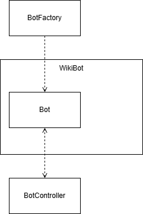
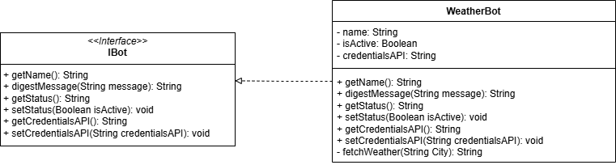
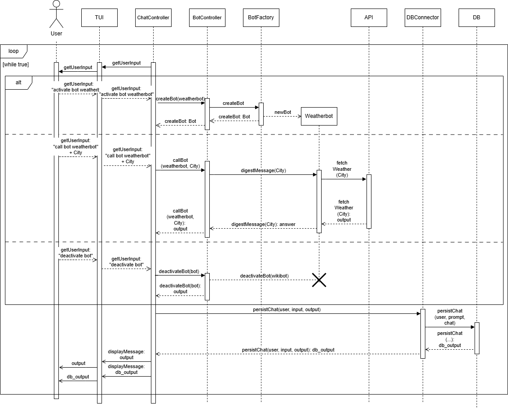

# WeatherBot – Systemdokumentation
## Kontextabgrenzung

WeatherBot ist ein modularer Bestandteil des VERCX404-Chatbot-Systems.
Er interagiert ausschließlich über das IBot-Interface mit dem BotController und verarbeitet Benutzeranfragen, indem er Wetterinformationen von der OpenWeather API abruft.

**Externe Schnittstellen:**

- OpenWeather API (api.openweathermap.org) über HTTP/REST

**Interne Schnittstellen:**

- BotController (Aktivierung, Deaktivierung, Nachrichtenweiterleitung)

- H2DatabaseConnector (Speicherung von Chatverläufen)

- GUI (TUI) → Benutzerinteraktion läuft indirekt über ChatController

## Lösungsstrategie

Der Bot implementiert das IBot-Interface und kann so vom BotController verwaltet werden.

Die Kommunikation mit OpenWeather erfolgt über HTTP GET und JSON-Verarbeitung (org.json).

Städte werden UTF-8 kodiert, um Sonderzeichen (z. B. „Köln“) korrekt zu behandeln.

Die Bot-Instanz speichert ihren Status (aktiv/inaktiv) und API-Zugangsdaten.

Modularer Aufbau ermöglicht die einfache Erweiterung um weitere Bots.

## Bausteinsicht

**Hauptbausteine:**

Baustein	Verantwortung
WeatherBot	Verarbeitung von Benutzeranfragen, Abruf von Wetterdaten aus der OpenWeather API
IBot	Schnittstelle für alle Bots (Name, Status, API-Zugang, Nachrichtendialog)
BotController	Verwaltung und Steuerung der Bots
H2DatabaseConnector	Speicherung und Abruf von Chatverläufen

Diagramme:

## Laufzeitsicht

Beispielablauf:

1. Benutzer gibt in der TUI ein: 
`call bot WeatherBot Köln`
2. ChatController erstellt ein UserInput-Objekt und übergibt es an den BotController.
3. BotController leitet den Aufruf an WeatherBot weiter.
4. WeatherBot baut die URL für die OpenWeather API, ruft sie auf und wertet die JSON-Antwort aus.
5. Ergebnis: 
*`Wetter in Köln: 22.3°C, klarer Himmel`*
6. Die Antwort wird über BotController → ChatController → GUI an den Benutzer zurückgegeben und parallel in der Datenbank gespeichert.

Schnittstellen

## IBot-Interface:

- `getName()`: Gibt den Namen des Bots zurück.
- `digestMessage(String message)`: Verarbeitet die Benutzeranfrage und liefert eine Antwort.
- `getStatus() / setStatus(Boolean)`: Aktivierungsstatus des Bots.

## Externe Schnittstelle:

OpenWeather API über HTTPS GET:

Endpoint:
`https://api.openweathermap.org/data/2.5/weather?q={city}&appid={API_KEY}&units=metric&lang=de`

Rückgabe: JSON-Objekt mit Temperatur, Wetterbeschreibung, etc.

## Fehlerbehandlung:

Kein API-Key → Meldung „API-Key fehlt.“

Stadt nicht gefunden → Meldung „Fehler beim Abrufen der Wetterdaten.“

Netzwerkfehler/Timeout → Meldung an Benutzer

## Erweiterungsmöglichkeiten

Anpassung der Sprache (z. B. Englisch, Französisch) durch lang-Parameter

Ausgabe zusätzlicher Wetterdaten (z. B. Luftfeuchtigkeit, Windgeschwindigkeit)

Integration von Vorhersagen (OpenWeather „forecast“ Endpoint)

Caching: häufig abgefragte Städte lokal speichern, um API-Calls zu reduzieren

Logging (z. B. mit SLF4J)

##Qualitätsmerkmale

Modularität: WeatherBot ist über das IBot-Interface vom Rest des Systems entkoppelt

Erweiterbarkeit: Neue Funktionen oder Bots lassen sich leicht integrieren

Zuverlässigkeit: API-Fehler werden abgefangen und als Benutzerfeedback zurückgegeben

Wartbarkeit: Klare Trennung von Verantwortlichkeiten (BotController ↔ Bot ↔ Datenbank)

Portabilität: Keine Abhängigkeit von einer bestimmten GUI oder Datenbank