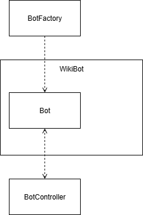
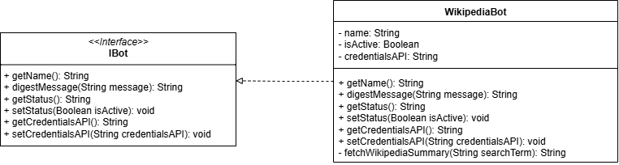
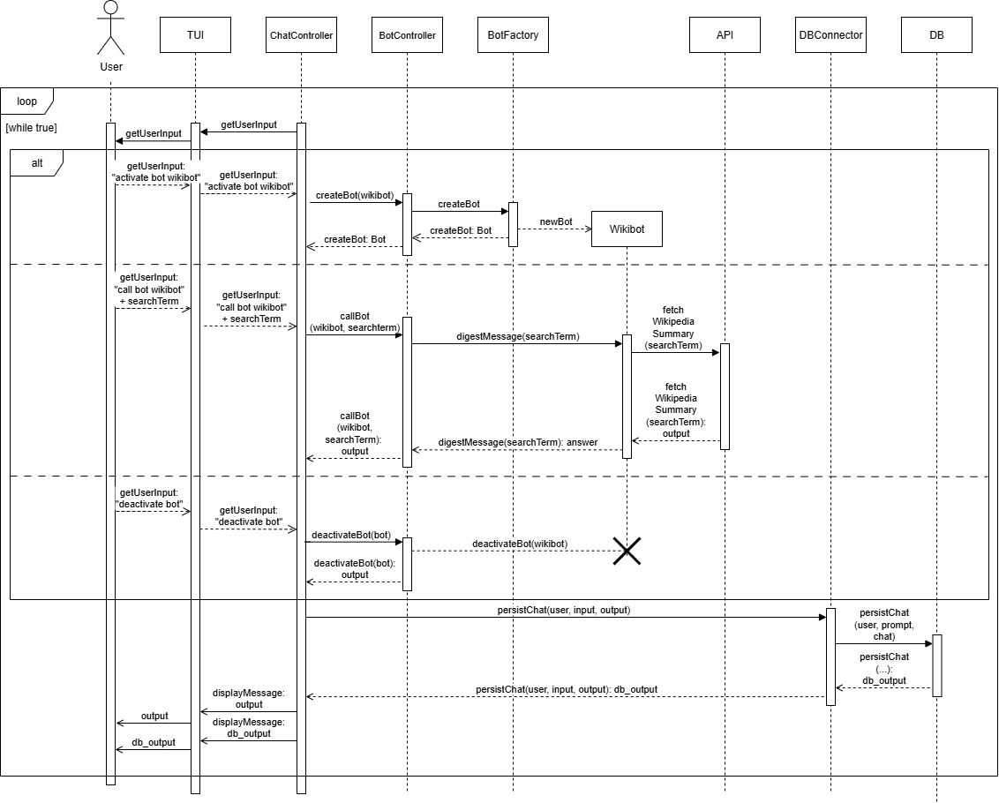

# WikipediaBot – Systemdokumentation

## Kontextabgrenzung

WikipediaBot ist ein modularer Bestandteil des VERCX404-Chatbot-Systems.  
Er interagiert ausschließlich über das IBot-Interface mit dem BotController und verarbeitet Benutzeranfragen, indem er Wikipedia-Zusammenfassungen liefert.

**Externe Schnittstellen:**
- Wikipedia API (de.wikipedia.org) über die Bibliothek jwiki

**Interne Schnittstellen:**
- BotController (Aktivierung, Deaktivierung, Nachrichtenweiterleitung)
- H2DatabaseConnector (Speicherung von Chatverläufen)

---

## Lösungsstrategie

- Der Bot implementiert das IBot-Interface und kann so vom BotController verwaltet werden.
- Die Kommunikation mit Wikipedia erfolgt über die Bibliothek jwiki und HTTP/REST.
- Die Bot-Instanz speichert ihren Status (aktiv/inaktiv) und API-Zugangsdaten.
- Modularer Aufbau ermöglicht die einfache Erweiterung um weitere Bots.

---

## Bausteinsicht

**Hauptbausteine:**

| Baustein         | Verantwortung                                  |
|------------------|------------------------------------------------|
| WikipediaBot     | Verarbeitung von Benutzeranfragen, Abfrage und Zusammenfassung von Wikipedia-Artikeln |
| IBot             | Schnittstelle für alle Bots                     |
| BotController    | Verwaltung und Steuerung der Bots               |

---

## Laufzeitsicht

---

## Schnittstellen

**IBot-Interface:**

- `getName()`: Gibt den Namen des Bots zurück.
- `digestMessage(String message)`: Verarbeitet die Benutzeranfrage und liefert eine Antwort.
- `getStatus() / setStatus(Boolean)`: Aktivierungsstatus des Bots.
- `getCredentialsAPI() / setCredentialsAPI(String)`: API-Zugangsdaten.

**Externe Schnittstelle:**

- Wikipedia API über jwiki:  
  - `getTextExtract(String searchTerm)`: Holt die Zusammenfassung eines Wikipedia-Artikels.

---

## Erweiterungsmöglichkeiten

- Anpassung der Sprache/Domäne (z.B. en.wikipedia.org)
- Erweiterung um weitere Wikipedia-Funktionen (z.B. Bilder, Links)
- Verbesserte Fehlerbehandlung und Logging

---

## Qualitätsmerkmale

- Modularität: Einfache Integration in das Gesamtsystem
- Erweiterbarkeit: Neue Funktionen können leicht ergänzt werden
- Zuverlässigkeit: Fehler werden abgefangen und dem Benutzer gemeldet
